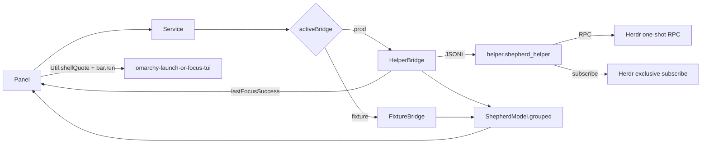

# Shepherd Design

Shepherd v0.1.0 implements Phases 0–3 on merged main. Release validation is complete for that software version. Wire-level Herdr/IPC and presentation schema live in [HERDR-CONTRACT.md](HERDR-CONTRACT.md).

## Manifest and ownership

`manifest.json` declares:

- `kinds`: `service`, `bar-widget`
- `entryPoints.service` → `Service.qml`
- `entryPoints.barWidget` → `Panel.qml`
- `barWidget.allowMultiple: false`, default section `right`

The shell mounts one Shepherd **service** singleton. The bar widget resolves it with `serviceFor("dev.tomnorris.shepherd")`. Only `HelperBridge` owns the production helper `Process`.

## Bridges

`Service.qml` selects exactly one active bridge:

| Mode | Condition | Bridge | Helper process | Presentation launch |
|------|-----------|--------|----------------|---------------------|
| Production | `SHEPHERD_DEV_FIXTURE` unset / not `"1"` | `HelperBridge` | Started | After correlated focus success |
| Fixture (dev only) | `SHEPHERD_DEV_FIXTURE=1` | `FixtureBridge` | Never started (`pluginRoot` forced empty) | Never |

Fixture mode loads `tests/fixtures/normalized_state.json` via `FileView` only. It must not open Herdr sockets, spawn `python3 -m helper.shepherd_helper`, or publish a launchable presentation (fixture keeps an unsupported descriptor; `lastFocusSuccess` stays null).

## Helper process

`HelperBridge` launches:

```text
workingDirectory = <manifest.__sourceDir>
command = ["python3", "-m", "helper.shepherd_helper"]
```

Stdin/stdout are JSON Lines. Unexpected exit sets `helperCrashed`, fails pending actions with fixed messages, and schedules a single restart timer (exponential delay, capped). `start()` no-ops while the process or restart timer is already active, so backoff cannot stack duplicate helpers.

Production construction uses `build_helper()`: one frozen environment snapshot drives both `resolve_socket_path` and `build_presentation_descriptor`, then `Helper(socket_path=…, presentation=…)` requires both explicitly. The helper never launches terminals, shells, or Omarchy launchers.

## Data flow



Normalized `state` lines (including sanitized `presentation`) are deduplicated in the helper before stdout publication. Identical agents/counts/presentation with the same `connection`/`stale` are suppressed; connection transitions still publish.

## QML component hierarchy

```text
Panel.qml
├── BarIconButton + KeyboardPanel / PanelKeyCatcher / Flickable
├── PanelHero (connection / empty / crash meta)
├── StatusSummary (counts)
├── panel error text (focus or presentation; fixed sanitized copy)
├── Presentation.qml (sanitize + presentAfterFocus)
└── WorkspaceSection[] → TabSection[] → AgentRow[]
```

`ShepherdModel` groups agents by workspace then tab without mutating the input `agents` array. Invalid records (missing `pane_id` / workspace / tab) are skipped.

## Presentation descriptors

Built once per helper process in Python (`helper/presentation.py`), then sanitized again at the IPC boundary and again in QML (`Presentation.qml`).

| Kind | `supported` | Typical source | Launch argv |
|------|-------------|----------------|-------------|
| `default` | `true` | No session/socket override, or conventional default socket | `["herdr"]` |
| `named` | `true` | `HERDR_SESSION`, or conventional `…/sessions/<name>/herdr.sock` | `["herdr", "--session", "<name>"]` |
| `socket_override` | `false` | Arbitrary / unclassifiable `HERDR_SOCKET_PATH` | `[]` |

Named-session app IDs are deterministic: `org.omarchy.herdr.session-` plus the first 12 hex characters of SHA-256 over the session name (UTF-8). Default app ID is `org.omarchy.herdr`.

Malformed, partial, wrong-type, extra-key, or semantically inconsistent descriptors downgrade to the unsupported shape. Published descriptors never include socket paths or other private fields. See [HERDR-CONTRACT.md](HERDR-CONTRACT.md) for the exact state schema.

## Focus then present

```text
AgentRow.activateRequested(paneId)
  → Panel.requestFocus
      captures expectedFocusRequestId from shepherd.focus() return value
  → Service.focus → HelperBridge.focus
  → JSONL {"type":"focus",...}
  → helper → Herdr agent.focus
  → action_result ok=true for that request_id
  → HelperBridge.lastFocusSuccess = { requestId, paneId }
  → Panel.tryConsumeFocusSuccess
      requires exact expectedFocusRequestId match
      ignores pre-bind / pre-reload records via ignoredFocusSuccess
      consumes expectation before launch
  → Presentation.presentAfterFocus
      service gates + sanitize
      Util.shellQuote every token
      exactly one bar.run(...) when supported
  → only if launched === true: start three-second cooldown, close panel once
```

### Why `lastFocusSuccess` instead of a custom signal

Omarchy’s `serviceFor(...)` surface did not reliably expose a custom QML signal from the Shepherd service (observed warning; signal not available to the panel). Completion is therefore a **property** on the service/bridge:

```text
lastFocusSuccess: { requestId: string, paneId: string } | null
```

The Panel keeps the request ID it initiated, consumes a matching property change once, and fail-closes on fixture mode, stale/disconnected/crashed service, unrelated or pre-existing records, and matching focus failures (`lastActionError`).

### Command construction

Supported descriptors only. Tokens are always:

1. `omarchy-launch-or-focus-tui`
2. `--app-id=<sanitized app_id>`
3. each sanitized `argv` string

Every token is passed through installed `Util.shellQuote`, then joined with spaces, then handed to `bar.run` exactly once. No `Process`, `eval`, custom quoting, or direct untrusted concatenation. Graphical-session environment (including Hyprland) stays with the Omarchy shell; the Python helper does not need a TTY or compositor vars.

### Managed-window lifecycle

Omarchy deduplicates by dedicated terminal app ID. Shepherd does not track window addresses and does not introspect the process running inside a matched window.

- Detaching from Herdr does not stop the persistent server or agents.
- Closing the visible managed client does not stop the server or agents; the next presentation can create a fresh managed terminal and attach.
- If the managed window remains open after detach, `omarchy-launch-or-focus-tui` still raises that app-ID window (often an ordinary shell) and does not automatically reattach. Closing the detached managed window restores automatic launch/attach.
- A manually launched Herdr terminal without Shepherd’s app ID is outside the dedup set, so the first Shepherd presentation may open one additional managed client.

### Presentation success, close, and cooldown

Phase 3 contract for managed presentation after focus:

1. Panel captures the request ID returned by `focus()`.
2. A matching `lastFocusSuccess` permits presentation (`tryConsumeFocusSuccess`).
3. Presentation validates the sanitized descriptor and calls `bar.run` when supported.
4. Only when presentation returns `launched: true`: restart the three-second presentation cooldown and close the Shepherd panel once.
5. Unsupported presentation, missing/non-callable `bar.run`, launcher failure, focus failure, unmatched/duplicate completion, fixture mode, and stale/disconnected/crashed state leave the panel open with fixed sanitized status/error copy.
6. Reopening during cooldown shows `Opening Herdr…`; activation stays disabled (not `Focusing…`).

Fixed user-facing presentation/focus copy:

- Focus failures: `Unable to focus pane.`
- Unsupported presentation: `Open Herdr manually for this session.`
- Missing `bar.run` / launch exceptions: `Unable to open Herdr.`

New valid focus activation clears a prior presentation message; successful presentation clears it.

Guards before calling `shepherd.focus`:

- service present; `connection === "connected"`; `stale === false`; `!helperCrashed`
- nonempty trimmed `pane_id`
- no existing `pendingFocus`
- presentation cooldown not running

While a focus is pending, all rows disable; the matching row shows `Focusing…`.

Panel toggle, Escape close, panel switching, scrolling, 380px content width, and null-service empty states remain as in the Phase 2 panel skeleton.

## Trust boundaries

- Helper normalizes Herdr snapshots; QML receives only documented agent/count fields plus sanitized presentation
- Python and QML each reject malformed presentation independently
- No prompts, pane output, transcripts, cwd, or socket paths reach the panel contract
- Helper stderr is one-line sanitized diagnostics only
- Public docs use fake pane IDs (`w1:p1`); live IDs stay out of documentation

## Fail-closed paths

| Condition | Behavior |
|-----------|----------|
| Unsupported / malformed presentation | Focus may still succeed; no launch; fixed manual-open message |
| Fixture mode | No helper Process; no launch |
| Stale, disconnected, or helper crash | No launch |
| Unmatched / duplicate / pre-reload success record | No launch |
| Focus `action_result` failure or protocol error | No launch; fixed focus error copy |
| `bar.run` missing or throws | No launch; fixed unable-open message |

## Repository layout

```text
manifest.json
Service.qml / HelperBridge.qml / FixtureBridge.qml / ShepherdModel.qml
Panel.qml / Presentation.qml / StatusSummary.qml
WorkspaceSection.qml / TabSection.qml / AgentRow.qml
helper/          # stdlib helper (RPC, subscribe, presentation, IPC)
tests/           # unit, fake-server, opt-in live integration
docs/
```
