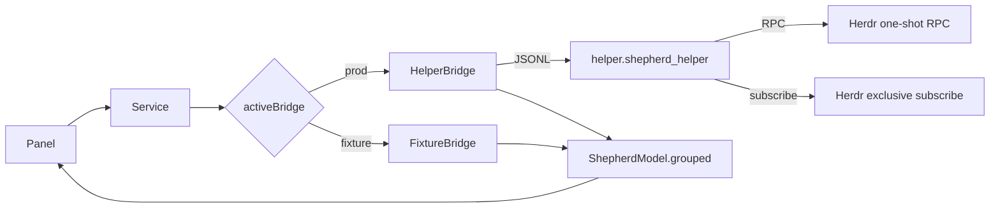

# Shepherd Design

Phase 2 architecture as implemented. Wire-level Herdr/IPC details live in [HERDR-CONTRACT.md](HERDR-CONTRACT.md).

## Manifest and ownership

`manifest.json` declares:

- `kinds`: `service`, `bar-widget`
- `entryPoints.service` → `Service.qml`
- `entryPoints.barWidget` → `Panel.qml`
- `barWidget.allowMultiple: false`, default section `right`

The shell mounts one Shepherd **service** singleton. The bar widget resolves it with `serviceFor("dev.tomnorris.shepherd")`. Only `HelperBridge` owns the production helper `Process`.

## Bridges

`Service.qml` selects exactly one active bridge:

| Mode | Condition | Bridge | Helper process |
|------|-----------|--------|----------------|
| Production | `SHEPHERD_DEV_FIXTURE` unset / not `"1"` | `HelperBridge` | Started |
| Fixture (dev only) | `SHEPHERD_DEV_FIXTURE=1` | `FixtureBridge` | Never started (`pluginRoot` forced empty) |

Fixture mode loads `tests/fixtures/normalized_state.json` via `FileView` only. It must not open Herdr sockets or spawn `python3 -m helper.shepherd_helper`.

## Helper process

`HelperBridge` launches:

```text
workingDirectory = <manifest.__sourceDir>
command = ["python3", "-m", "helper.shepherd_helper"]
```

Stdin/stdout are JSON Lines. Unexpected exit sets `helperCrashed`, fails pending actions with fixed messages, and schedules a single restart timer (exponential delay, capped). `start()` no-ops while the process or restart timer is already active, so backoff cannot stack duplicate helpers.

## Data flow



Normalized `state` lines are deduplicated in the helper before stdout publication. Identical agents/counts with the same `connection`/`stale` are suppressed; connection transitions still publish.

## QML component hierarchy

```text
Panel.qml
├── BarIconButton + KeyboardPanel / PanelKeyCatcher / Flickable
├── PanelHero (connection / empty / crash meta)
├── StatusSummary (counts)
├── focus error text (fixed sanitized copy)
└── WorkspaceSection[] → TabSection[] → AgentRow[]
```

`ShepherdModel` groups agents by workspace then tab without mutating the input `agents` array. Invalid records (missing `pane_id` / workspace / tab) are skipped.

## Focus path

```text
AgentRow.activateRequested(paneId)
  → TabSection.focusRequested
  → WorkspaceSection.focusRequested
  → Panel.requestFocus
  → Service.focus → HelperBridge.focus
  → JSONL {"type":"focus",...}
  → helper → Herdr agent.focus
```

Guards before calling `shepherd.focus`:

- service present; `connection === "connected"`; `stale === false`; `!helperCrashed`
- nonempty trimmed `pane_id`
- no existing `pendingFocus`

While pending, all rows disable; the matching row shows `Focusing…`. Success clears pending. Failures shown in the panel use the fixed string `Unable to focus pane.` (not request IDs, paths, or exception text). Fixture `focus` returns a request id and clears pending without Process/Herdr I/O.

Panel toggle, Escape close, panel switching, scrolling, 380px content width, and null-service empty states remain as in the Phase 2 panel skeleton.

## Trust boundaries

- Helper normalizes Herdr snapshots; QML receives only the documented agent/count fields
- No prompts, pane output, transcripts, or cwd reach the panel contract
- Helper stderr is one-line sanitized diagnostics only
- Public docs use fake pane IDs (`w1:p1`); live IDs stay out of documentation

## Detached / no-visible-client limitation

`agent.focus` changes focus inside the persistent Herdr **session**. Shepherd does not open a terminal, attach a Herdr client, or raise an existing window. If the user has detached and closed the client terminal, a successful focus may not present the pane. Users must launch/attach Herdr separately for v0.1. This is a presentation limitation, not data loss or a helper crash.

### Future design question

Launch or attach a visible Herdr client when activating an agent and no client is available. Later design must cover: detecting a visible client; selecting named vs default session; Omarchy’s supported terminal-launch mechanism; avoiding duplicate windows; ordering attach vs pane focus; safe behavior from panels without an interactive TTY. Do not assume the noninteractive helper should run `herdr agent attach` unless Herdr/Omarchy architecture confirms that path.

## Repository layout (Phase 2)

```text
manifest.json
Service.qml / HelperBridge.qml / FixtureBridge.qml / ShepherdModel.qml
Panel.qml / StatusSummary.qml / WorkspaceSection.qml / TabSection.qml / AgentRow.qml
helper/          # Phase 1 helper (stdlib)
tests/           # unit, fake-server, opt-in live integration
docs/
```
